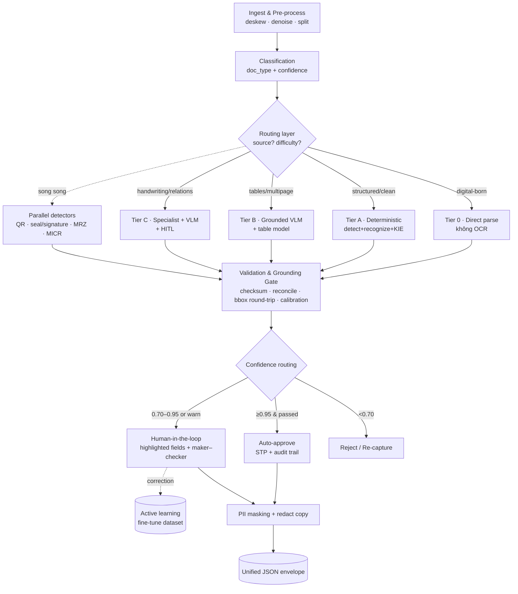

# Thiết kế Kỹ thuật — Pipeline IDP Ngân hàng

> **Loại tài liệu**: Technical Design Document (TDD)
> **Phạm vi**: Kiến trúc, tech stack, kỹ thuật xử lý ảnh & model đề xuất cho từng stage của pipeline Intelligent Document Processing.
> **Nguyên tắc ưu tiên**: **Độ chính xác → Truy vết (provenance) → Chi phí.**
> **Tài liệu liên quan**: BA – Document Catalog for IDP v1.0.
> **Phiên bản**: 1.0 (draft cho pilot)

---

## 1. Tổng quan & Triết lý thiết kế

### 1.1. Luận điểm kiến trúc

Thứ tự ưu tiên *chính xác → truy vết → cost* loại bỏ cả hai phương án thuần:

- **Pure end-to-end VLM** — mạnh accuracy/ngữ nghĩa nhưng yếu truy vết native và mang rủi ro **hallucination** (sinh text "nghe hợp lý mà sai"), không chấp nhận được với field tiền/định danh.
- **Pure traditional pipeline** — rẻ, deterministic, truy vết tốt nhưng **chạm trần** ở relationship (hợp đồng, L/C), bảng phức tạp (BCTC) và chữ viết tay.

→ Kiến trúc chọn: **Hybrid "Grounded-first, Phân tầng (Tiered), Nặng Validation"**. Mặc định dùng engine rẻ & deterministic; chỉ "leo thang" lên VLM cho phần đuôi khó; một **lớp Validation + Grounding** đóng vai trò cổng tin cậy chung cho mọi tier.

### 1.2. Nguyên tắc thiết kế (design principles)

1. **Provenance là bắt buộc.** Mọi field có ý nghĩa tài chính/định danh phải kèm `confidence` + `bbox` (tọa độ nguồn). Field không gắn được bbox → đánh dấu nghi ngờ.
2. **Validation độc lập vendor.** Lớp business-rule validation (checksum, đối chiếu số học, số-bằng-chữ) là tài sản riêng, không phụ thuộc engine OCR — đây là nơi bắt lỗi mà không % accuracy nào của OCR bắt được.
3. **Tier routing trước, model sau.** Phân loại độ khó & nguồn (digital vs ảnh) trước khi chọn engine. Đây là đòn bẩy lớn nhất cho cả accuracy lẫn cost.
4. **Grounding vừa để truy vết vừa làm tripwire hallucination.** Field tiền/ID phải qua *round-trip grounding check*.
5. **Confidence phải được calibrate.** Toàn bộ routing theo ngưỡng confidence chỉ đúng khi `confidence ≈ accuracy thật` (đo bằng ECE).
6. **On-prem cho dữ liệu nhạy cảm.** KYC, tài sản đảm bảo, thanh toán, pháp lý chạy self-host open-weight; không route dữ liệu khách qua hạ tầng vendor công cộng.
7. **Human-in-the-loop + maker–checker** cho mọi field tiền/định danh, bất kể confidence.

---

## 2. Kiến trúc tổng thể

### 2.1. Sơ đồ luồng



### 2.2. Mô hình phân tầng (Tiering)

| Tier | Khi nào route vào | Mục tiêu |
|---|---|---|
| **Tier 0 — Direct parse** | Nguồn digital-born (PDF số, XML hóa đơn điện tử, SWIFT MT, e-contract) | ~100% accuracy, provenance miễn phí, cost ~0, zero hallucination |
| **Tier A — Deterministic** | Ảnh/scan của tài liệu template ổn định (CCCD, GTGT giấy, ĐKKD, voucher) | STP cao, bbox native, rẻ, deterministic |
| **Tier B — Grounded VLM** | Bảng phức tạp, đa trang, layout rối (sao kê scan, BCTC, packing list, sổ đỏ) | Hiểu layout toàn cục + grounding cho provenance |
| **Tier C — Specialist + VLM** | Chữ viết tay, relationship, clause hierarchy (séc/UNC, hợp đồng, L/C) | Vượt trần truyền thống; luôn kèm HITL |
| **Detectors** | Luôn chạy song song | QR/barcode, dấu/chữ ký, MRZ, MICR — tách khỏi OCR |

---

## 3. Đặc tả từng Stage — Kỹ thuật & Model đề xuất

### 3.1. Stage 1 — Ingestion & Pre-processing

**Mục đích**: chuẩn hóa input đa định dạng/đa chất lượng về dạng tối ưu cho stage sau.

**Kỹ thuật xử lý ảnh (theo thứ tự pipeline)**:

| Bước | Kỹ thuật | Tool / Model đề xuất |
|---|---|---|
| Chuẩn hóa định dạng | HEIC→JPEG, rasterize PDF, tách TIFF đa trang | `pillow-heif`, `PyMuPDF`/`pdf2image`, `Wand` |
| Đánh giá chất lượng | Blur detection (variance of Laplacian), độ phân giải, độ sáng → reject nếu quá kém | OpenCV (`cv2.Laplacian`), ngưỡng tùy chỉnh |
| Phát hiện & crop biên trang | Document boundary / contour detection | OpenCV contour, hoặc model page-segmentation |
| Khử nghiêng (deskew) | Hough transform / projection profile / Radon | OpenCV; `deskew` lib; hoặc text-line angle estimator |
| Phân loại hướng (0/90/180/270) | Classifier nhẹ | **PP-LCNet doc-orientation** (PaddleOCR) |
| Dewarp (cong/gập) | Học sâu khôi phục mặt phẳng tài liệu | **UVDoc** / **DocTr++** / DewarpNet |
| Khử nhiễu | Non-local means, median; learned denoiser cho fax/photocopy | OpenCV `fastNlMeansDenoising`; Real-ESRGAN (kèm super-res) |
| Khử bóng/lóa | Illumination normalization, retinex, background subtraction | OpenCV; thuật toán shadow-removal |
| Super-resolution (DPI thấp) | Nâng phân giải ảnh chụp mờ | **Real-ESRGAN** (dùng có chọn lọc) |
| Binarization (chỉ khi cần) | Adaptive threshold | Sauvola/Niblack, Otsu (OpenCV) |

> ⚠️ **Lưu ý quan trọng**: model detection/VLM hiện đại **bền với nhiễu** và việc over-binarize/over-process có thể *làm giảm* chất lượng VLM. → Áp dụng IP **theo tier**: tiền xử lý nặng (binarize, denoise mạnh) cho luồng Tesseract-style; tiền xử lý nhẹ (chỉ deskew + orient + dewarp) cho luồng VLM. Lưu cả ảnh gốc để VLM dùng và phục vụ provenance.

**Output trung gian**: ảnh/PDF đã chuẩn hóa + metadata (góc xoay, điểm chất lượng, ảnh gốc reference).

---

### 3.2. Stage 2 — Classification

**Mục đích**: gán `doc_type` để định tuyến.

**Kỹ thuật / Model**:

- **Đa phương thức (khuyến nghị)**: kết hợp đặc trưng *thị giác* (ảnh trang) + *văn bản* (OCR nhanh 1 dòng tiêu đề).
- Model: **LayoutLMv3** (visual + text + layout) cho độ chính xác cao; hoặc **Donut** (OCR-free classification).
- Phương án nhẹ/nhanh: CNN ảnh trang (**EfficientNet / PP-LCNet**) cho phân loại thô + rule trên text.
- Hỗ trợ **few-shot**: thêm doc_type mới bằng vài mẫu, tránh retrain toàn bộ.

**Output**: `doc_type` + `doc_type_confidence`. Nếu confidence thấp → route review hoặc xử lý generic.

---

### 3.3. Stage 3 — Splitting

**Mục đích**: tách 1 file nhiều tài liệu; ghép bảng tràn trang.

**Kỹ thuật / Model**:

- **Tách tài liệu**: phát hiện ranh giới doc trong file đa trang (page-stream segmentation) dựa trên thay đổi doc_type/layout giữa các trang.
- **Ghép bảng tràn trang (cross-page table merge)**: heuristic header-matching + so khớp schema cột giữa các trang liên tiếp; cần cho sao kê & BCTC.
- Tool: logic tùy chỉnh dựa trên output classification + layout; thư viện hỗ trợ: `PyMuPDF` (cắt/ghép trang).

**Output**: danh sách document con, mỗi cái có `doc_type` riêng.

---

### 3.4. Stage 4 — Extraction (lõi phân tầng)

#### Tier 0 — Direct parse (digital-born)

**Nguyên tắc**: KHÔNG OCR PDF số. Trích thẳng text-layer / cấu trúc gốc.

| Loại | Kỹ thuật / Tool |
|---|---|
| PDF số (sao kê e-banking, e-contract) | `pdfplumber` / `PyMuPDF` (text + tọa độ char → bbox miễn phí) |
| Hóa đơn điện tử (XML) | Parse XML theo chuẩn hóa đơn (`lxml`) |
| SWIFT MT messages | Parser theo field-tag (vd `:20:`, `:32A:`) |
| Bảng trong PDF số | **Camelot** / **Tabula** (lattice/stream) — không cần OCR |

#### Tier A — Deterministic (template ổn định)

**Pipeline**: Text Detection → Recognition → Layout/KIE.

| Thành phần | Model đề xuất | Ghi chú |
|---|---|---|
| Text detection | **DBNet++** / **PP-OCRv5 det** / CRAFT | trả bbox/quad |
| Recognition (in) | **PP-OCRv5 rec (SVTR)** | đa ngôn ngữ |
| Recognition tiếng Việt | **VietOCR (TransformerOCR)** | dấu thanh chuẩn |
| KIE / Form K-V | **LayoutLMv3** (fine-tune theo template) / **Donut** / PP-ChatOCR / SDMGR | per-field bbox + confidence |
| **Phương án VN thương mại** | **FPT.AI Reader** / **Viettel OCR** | đã tuned cho CCCD/CMND/GTGT, chữ in ~99%; **bắt buộc verify** có trả bbox+confidence per-field theo schema |

#### Tier B — Grounded VLM (bảng/đa trang/layout rối)

| Thành phần | Model đề xuất | Ghi chú |
|---|---|---|
| Document parsing + grounding | **PaddleOCR-VL 1.5** (task *Text Spotting / Grounded OCR*, quad 4 điểm) | vừa text vừa tọa độ; on-prem |
| Hybrid pipeline thay thế | **MinerU 2.5** / **Docling** (RT-DETR layout) | tách header/footer, output Markdown+JSON |
| Table structure recognition | **Table-Transformer (TATR)** / PP-Structure (SLANet) | cross-check cấu trúc bảng |
| Reading order | **Surya order** / LayoutReader | giữ thứ tự đọc đa cột |

#### Tier C — Specialist + VLM (viết tay/quan hệ/điều khoản)

| Năng lực | Model đề xuất | Ghi chú |
|---|---|---|
| Handwriting (séc, UNC) | **TrOCR (trocr-large-handwritten)** fine-tune VN / VN thương mại | + **bắt buộc** đối chiếu số-bằng-chữ |
| Relationship extraction (L/C, hợp đồng, trade finance) | **VLM** (Qwen3-VL / generalist frontier) trên text đã trích | luôn kèm HITL, STP thấp |
| Clause hierarchy (Điều→Khoản→Điểm) | VLM + post-process cây phân cấp | hierarchy accuracy là metric riêng |
| Cross-document reconciliation (L/C ↔ Invoice ↔ B/L) | Logic đối chiếu trên entity đã trích + VLM hỗ trợ | mục tiêu: discrepancy recall ≥95% |

#### Detectors song song (mọi tier)

| Năng lực | Kỹ thuật / Model | Ngưỡng |
|---|---|---|
| QR / barcode | **pyzbar (ZBar)** / **ZXing** / OpenCV `WeChatQRCode` | ≥99.9% |
| Con dấu (seal/stamp) | **PaddleOCR seal recognition** / YOLOv8/RT-DETR fine-tune | recall ≥98% |
| Chữ ký (signature) | Object detector fine-tune (YOLO) | recall ≥98% |
| MRZ (hộ chiếu/CCCD) | **PassportEye** + regex + ICAO checksum | bắt buộc checksum |
| MICR (séc) | Reader E-13B / CMC-7 chuyên dụng | — |
| Chip CCCD | Đọc qua **NFC** (không OCR) khi có | đối chiếu mặt thẻ |

**Output Stage 4**: structured data thô + bbox + confidence per-field cho từng document con.

---

### 3.5. Stage 5 — Validation & Grounding Gate (cổng tin cậy)

**Mục đích**: bắt lỗi extraction & hallucination *trước* khi vào hệ thống. Đây là stage quyết định độ tin cậy.

**Các lớp kiểm tra**:

1. **Checksum / check-digit**: `id_number`, `tax_code`, `account_no`, MRZ → xác thực theo thuật toán.
2. **Đối chiếu số học (arithmetic reconciliation)**:
   - `Σ line_items + vat = total`
   - `opening_balance + Σ transactions = closing_balance`
   - Lệch → flag, không auto-tính.
3. **Số-bằng-chữ vs bằng-số** (séc/UNC): `amount_figures == amount_words` → lệch là red flag.
4. **Round-trip grounding check** (tripwire hallucination): với field tiền/ID do VLM trả → OCR lại đúng vùng `bbox` → so khớp value. Không khớp / không có bbox → flag nghi ngờ.
5. **Cross-document reconciliation** (trade finance): đối chiếu chéo bộ chứng từ.
6. **Confidence calibration**: chuẩn hóa confidence thô về xác suất đúng thật.

**Kỹ thuật / Tool**:

- Rule engine: tùy chỉnh (Python) hoặc `JSON Logic` / `Drools`-style; tách theo `doc_type`.
- **Calibration**: **Temperature scaling** / **Isotonic regression** / Platt scaling, fit trên holdout có nhãn — đo bằng **ECE**. Áp **per engine/doc_type**.
- Dual-engine cross-check cho field ≥99.5%: chạy 2 engine độc lập, chỉ auto-approve khi khớp.

**Output**: data đã validate + danh sách `warnings` + cờ lỗi.

---

### 3.6. Stage 6 — PII Handling

**Mục đích**: phát hiện & che dữ liệu nhạy cảm; lưu bản redact.

**Kỹ thuật / Model**:

- **Microsoft Presidio** (PII detection + anonymization) làm khung.
- NER tiếng Việt: **underthesea** / **VnCoreNLP** + **PhoBERT-NER** cho tên/địa chỉ.
- Regex chuyên dụng cho định dạng VN: số CCCD/CMND, số tài khoản, ngày sinh, mã số thuế.
- Redaction ảnh: che vùng theo `bbox` (vẽ đè) → xuất PDF/ảnh redact, lưu URI.

**Output**: data + `pii.detected[]` + `redacted_copy_uri`.

---

### 3.7. Stage 7 — Human-in-the-loop (HITL)

**Mục đích**: route field confidence thấp cho người review; thu correction để cải thiện.

**Kỹ thuật / Tool**:

- **Review UI**: **Label Studio** (hỗ trợ review + active learning) hoặc UI tùy chỉnh; reviewer thấy **field được highlight trên ảnh gốc qua bbox** (đây là lý do provenance bắt buộc).
- **Maker–checker**: hai mắt xác nhận với field tiền/định danh.
- **Active learning loop**: correction → dataset fine-tune định kỳ (few-shot/fine-tune) cho Tier A KIE và Tier C handwriting.

**Output**: data đã xác nhận + audit log (ai sửa, sửa gì, khi nào).

---

## 4. Tech Stack Tổng hợp

| Lớp | Thành phần | Công nghệ đề xuất |
|---|---|---|
| **Xử lý ảnh** | IP cơ bản | OpenCV, Pillow/pillow-heif, scikit-image |
| | Dewarp / super-res | UVDoc/DocTr++, Real-ESRGAN |
| **Doc parsing** | PDF/XML/SWIFT | PyMuPDF, pdfplumber, Camelot, lxml |
| **OCR/CV models** | Detection/Recognition/Layout | PaddleOCR (PP-OCRv5, PP-Structure), VietOCR, Table-Transformer, Surya |
| **VLM** | Grounded parsing | PaddleOCR-VL 1.5 *(target production)* · **Qwen3-VL-8B** *(engine slice đầu, xem callout)* / dots.ocr |
| **KIE/NLP** | Field extraction, NER | LayoutLMv3, Donut, Presidio, underthesea/VnCoreNLP, PhoBERT |
| **Detectors** | QR/seal/MRZ/MICR | pyzbar, YOLOv8/RT-DETR, PassportEye |
| **Model serving** | VLM | **vLLM** / **SGLang** *(production; slice đầu dùng **LM Studio** OpenAI-compatible API)* |
| | CV/ONNX | **Triton Inference Server** / ONNX Runtime / TorchServe |
| **Orchestration** | Workflow & queue | **Temporal** hoặc Airflow + **Kafka/RabbitMQ** + workers |
| **API** | Service layer | **FastAPI** |
| **Storage** | Object / metadata | **MinIO** (on-prem) hoặc S3 · **PostgreSQL** · (tùy chọn vector store) |
| **Hạ tầng** | Container / GPU | Docker · Kubernetes · GPU node (A100/L40S class) |
| **Review** | HITL UI | Label Studio / custom |
| **Observability** | Metric & eval | Prometheus + Grafana · dashboard eval nội bộ |
| **Calibration** | Confidence | scikit-learn (isotonic/Platt), temperature scaling |

> **Build vs Buy (VN)**: cân nhắc dùng **FPT.AI / Viettel OCR** cho Tier A (CCCD/GTGT) và handwriting nếu chúng đáp ứng yêu cầu **on-prem + per-field bbox/confidence**; tự host open-weight (PaddleOCR-VL) cho Tier B/C khi cần kiểm soát dữ liệu.

> **⚠️ Engine slice đầu (thực thi hiện hành, chốt 2026-06-08)**: Bảng trên mô tả **target production**. Slice đầu (M0–M4) bootstrap Tier B bằng **Qwen3-VL-8B qua LM Studio** (OpenAI-compatible API, 0 hạ tầng Docker/vLLM) trên GPU thực tế **RTX 5060 Ti 16GB** — KHÔNG phải A100/L40S. PaddleOCR-VL 1.5 / vLLM là **mục tiêu accuracy về sau**, cắm cùng `ParseEngine` interface. Đánh đổi: Qwen3-VL không có quad/bbox grounding native. **Source of truth: `AGENT.md` mục 4–5**; lộ trình: `implementation-plan.md`.

---

## 5. Output Schema chuẩn (Provenance envelope)

Mọi tài liệu trả về một envelope JSON thống nhất. Bắt buộc với mọi field: `value`, `confidence` (đã calibrate), `page`, `bbox`, `validation`.

```json
{
  "document_id": "DOC-20260608-000123",
  "doc_type": "bank_statement",
  "doc_type_confidence": 0.985,
  "tier": "B",
  "language": "vi",
  "page_count": 4,
  "processing": {
    "model_version": "idp-core-v1.0",
    "engines_used": ["paddleocr-vl-1.5", "table-transformer"],
    "processed_at": "2026-06-08T10:22:31Z",
    "status": "needs_review"
  },
  "fields": [
    {
      "name": "account_no",
      "value": "0123456789",
      "confidence": 0.997,
      "confidence_calibrated": true,
      "page": 1,
      "bbox": [0.12, 0.08, 0.34, 0.11],
      "grounding_verified": true,
      "validation": "passed"
    }
  ],
  "tables": [ { "name": "transactions", "rows": [] } ],
  "detections": { "signature_present": true, "seal_present": true, "qr_codes": [] },
  "pii": { "detected": ["id_number", "account_no"], "redacted_copy_uri": "minio://.../redacted.pdf" },
  "warnings": []
}
```

---

## 6. Khung Chất lượng & Eval

### 6.1. Bộ chỉ số

| Chỉ số | Áp dụng |
|---|---|
| Field-level Accuracy | mọi field cấu trúc |
| CER / WER | text thuần, free text |
| Table TEDS / structure F1 | sao kê, BCTC |
| Classification F1 | stage 2 |
| **Grounding accuracy** (bbox đúng vùng) | **đo TÁCH biệt với text accuracy** |
| STP Rate | toàn pipeline |
| ECE (calibration) | chất lượng confidence |
| Hallucination Rate | luồng VLM |

### 6.2. Phân tầng confidence

| Tầng | Ngưỡng | Hành động |
|---|---|---|
| Auto-approve | ≥0.95 *và* validation passed | xử lý tự động |
| Review | 0.70–0.95 *hoặc* cảnh báo | reviewer kiểm field highlight |
| Reject | <0.70 / không đọc được | yêu cầu chụp lại |

> Field tiền & định danh: **luôn maker–checker**, bất kể confidence.

### 6.3. Kỳ vọng accuracy theo nhóm field

| Nhóm field | Mục tiêu | Ràng buộc |
|---|---|---|
| Khóa định danh (ID, account, tax code, GCN) | ≥99.5% | + checksum, dual-engine |
| Số tiền & tài chính | ≥99% | + validation logic |
| Ngày tháng, tên | ≥98% | |
| Cấu trúc bảng | ≥95% | merge/spanning đúng |
| Địa chỉ, free text VN | ≥95% | |
| Chữ viết tay | ≥92% | + đối chiếu chéo |
| QR/Barcode | ≥99.9% | |
| Phát hiện dấu/chữ ký | recall ≥98% | ưu tiên không bỏ sót |

---

## 7. Bảo mật, Tuân thủ & Audit

- **Deployment**: on-prem/private cho KYC, tài sản đảm bảo, thanh toán, pháp lý. Cloud chỉ cho nhóm rủi ro thấp hoặc khi có DPA + redact.
- **PII**: detect + mask + lưu bản redact; tuân thủ quy định bảo vệ dữ liệu cá nhân.
- **Audit trail**: lưu vết `model_version`, thời điểm xử lý, người review, thay đổi giá trị.
- **Chống hallucination**: validation đối chiếu output ↔ ảnh gốc; field không có bbox nguồn → nghi ngờ.
- **Adaptability**: học từ correction của reviewer (active learning) để cải thiện theo thời gian.

---

## 8. Lộ trình triển khai

| Phase | Phạm vi | Thành phần cần build |
|---|---|---|
| **Phase 1** | CCCD/KYC + GTGT + Sao kê | Tier 0 + Tier A + **lớp Validation & Grounding + Calibration + envelope** (khung lõi dùng mãi) |
| **Phase 2** | UNC/Séc + BCTC + Tài sản đảm bảo | Tier C handwriting + đối chiếu số-bằng-chữ; Tier B table + cross-page merge; detector dấu/chữ ký |
| **Phase 3** | Trade finance + Hợp đồng pháp lý | Relationship extraction + cross-document reconciliation (VLM-heavy, STP thấp nhất) |

---

## 9. Rủi ro & Giả định cần kiểm trong Pilot

1. **Per-field provenance từ vendor**: xác nhận VN-tuned commercial có trả `bbox` + `confidence` **per-field** đúng schema envelope. Nhiều giải pháp trả field nhưng *không* trả provenance → phá vỡ toàn bộ tầng truy vết.
2. **Grounding accuracy ≠ text accuracy**: ngay cả VLM SOTA vẫn hay trỏ sai vùng (theo BBox-DocVQA). Phải đo grounding accuracy **tách biệt**.
3. **Confidence calibration**: kiểm ECE thực tế; nếu confidence lệch nặng, ngưỡng 0.95 vô nghĩa cho đến khi calibrate.
4. **Chất lượng input thực tế** (ảnh chụp nghiêng/lóa/fax): đo lại STP target sau pilot với dữ liệu thật của ngân hàng.
5. **Tài nguyên GPU & latency**: cân đối throughput Tier B/C với ngân sách GPU on-prem.

---

*Hết bản thiết kế. Phiên bản 1.0 — đề xuất rà soát lại ngưỡng & lựa chọn model sau pilot với dữ liệu thực tế.*