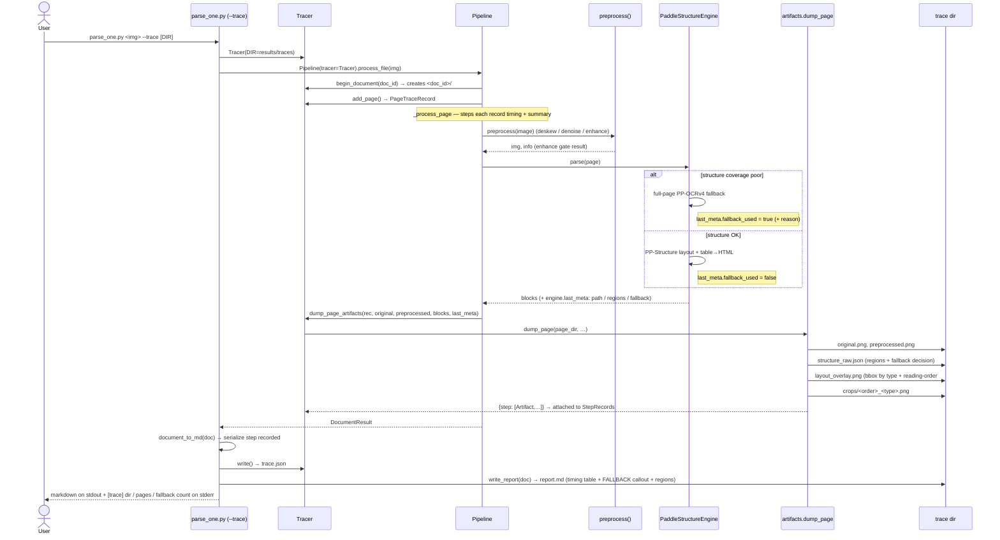

# Sequence — `parse_one.py --trace`

How a single document flows when tracing is enabled. The `Tracer` is opt-in: when it is
`None` (the eval/batch default) the pipeline runs identically with zero trace overhead.

Accurate to `scripts/parse_one.py` + `src/idp_trad/pipeline.py` (`_process_page`),
`src/idp_trad/trace/tracer.py`, and `src/idp_trad/trace/artifacts.py`.

## Notes

- The pipeline does **not** depend on the tracer module beyond accepting an optional
  `Tracer`. The engine merely exposes a read-only `last_meta` dict (path used, region
  count, fallback decision) — data exposure, not a tracer dependency.
- The **serialize** step is timed and recorded by the CLI (`parse_one.py`), since
  `document_to_md` is called there, not inside `Pipeline`.
- Artifact rendering (`idp_trad.trace.artifacts`) is lazy-imported and fully guarded:
  any failure is swallowed so tracing can never break a run.
